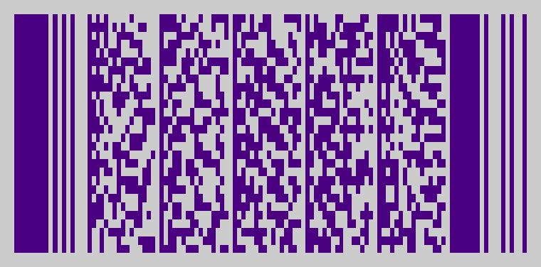

PDF417 2D barcode generator for Python
======================================

[]()
[](https://twitter.com/ihabunek)

Licensed under the MIT License, see [LICENSE.md](LICENSE.md).

## Usage

Creating bar codes is done in two steps:

* `pdf417.encode()` will convert text or bytes into an array of low level code
  words which are used to form the bar code.
* `pdf417.render_image()` takes the code words and returns the bar code as a
  [Pillow Image](https://pillow.readthedocs.io/en/3.3.x/reference/Image.html)
  object.

### Basic usage

```py
from pdf417 import encode, render_image

text = """Beautiful is better than ugly.
Explicit is better than implicit.
Simple is better than complex.
Complex is better than complicated."""

codes = encode(text)
image = render_image(codes)
image.show()
```


### Columns

The bar code size can be customized by defining the number of columns used to
render the data, between 1 and 30, the default value is 6. A bar code can have a
maximum of 90 rows, so for larger data sets you may need to increase the number
of columns to decrease the rows count.

```py
codes = encode(text, columns=12)
image = render_image(codes)
image.show()
```


### Security level

Increasing the security level will produce stronger (and more numerous) error
correction codes, making the bar code larger, but less prone to corruption. The
security level can range from 0 to 8, and procuces `2^(level+1)` error
correction code words, meaning level 0 produces 2 code words and level 8
produces 512. The default security level is 2.

```py
codes = encode(text, columns=12, security_level=6)
image = render_image(codes)
image.show()
```


### Image rendering options

The PDF417 bar code is constructed of bars called modules. They are like pixels
but not square.

The `render_image` function takes the following options:

* `scale` - the scale of the barcode elements, the width of modules in px (default: 3)
* `ratio` - the height to width ratio of modules (default: 3)
* `padding` - image padding in px (default: 20)
* `fg_color` - foreground color (default: '#000000')
* `bg_color` - background color (default: '#FFFFFF')

Colors can be specified as hex codes or using HTML color names.



```py
codes = encode(text, columns=3)
image = render_image(codes, scale=5, ratio=2, padding=5, fg_color="Indigo", bg_color="#ddd")
image.show()
```

## See also

* [pdf417-php](https://github.com/ihabunek/pdf417-php) - a PHP implementation
* [golang-pdf417](https://github.com/ruudk/golang-pdf417) - a Go implementation
